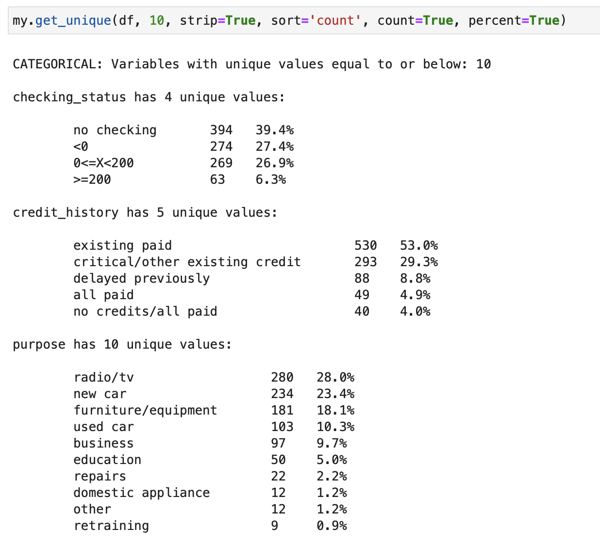

# mytools
Some helpful python functions for data science. I'm not a software engineer, be kind!

## Change Log
- 2023-06-22: Added plot_charts_with_hue (v0.1). Was originally going to add as a parameter to plot_charts, but it
    is proving challenging. May merge them later.
  - Updated get_unique (v0.2) with minor logic fix.
  - Updated plot_charts (v0.2) to better handle continuous variables with a dtype check, and support for sampling. 
    Also added the ability to manually specify the categorical vs. continuous columns.


## get_unique
Gets all the unique values of variables in a dataframe. For each variable, if the number of unique values is equal to or below "n", it will treat them as categorical and output the unique values (optionally with counts, percentages). For variables with unique values above "n", it will consider them continuous numerical. If "cont" is True, you will see a statistical summary of these. If "plot" is True, charts will be drawn for all of the variables (categorical will get bar charts, continuous will get histograms).
I created this because I was tired of fetching all the unique values by hand. It's meant to speed up initial exploration of a dataset.
```
def get_unique(df, n=20, sort='none', list=True, strip=False, count=False, percent=False, plot=False, cont=False):
    
    Version 0.2
    Obtains unique values of all variables below a threshold number "n", and can display counts or percents
    Parameters:
    - df: dataframe that contains the variables you want to analyze
    - n: int (default is 20). Maximum number of unique values to consider (avoid iterating continuous data)
    - sort: str, optional (default='none'). Determines the sorting of unique values:
        'none' will keep original order,
        'name' will sort alphabetically/numerically,
        'count' will sort by count of unique values (descending)
    - list: boolean, optional (default=True). Shows the list of unique values
    - strip: boolean, optional (default=False). True will remove single quotes in the variable names
    - count: boolean, optional (default=False). True will show counts of each unique value
    - percent: boolean, optional (default=False). True will show percentage of each unique value
    - plot: boolean, optional (default=False). True will show a basic chart for each variable
    - cont: boolean, optional (default=False). True will analyze variables over n as continuous

    Returns: None
    
```
  

## plot_charts
Gets all the variables in a dataframe and outputs a grid of charts. For each variable, if the number of unique values is equal to or below "n", it will treat them as categorical and plot a bar chart. For variables with unique values above "n", it will consider them continuous and plot a histograms.
I created this because I was tired of plotting these charts one at a time during the very first stage of data visualization. Pairplots work too, but the histograms are tiny, and this is meant for early exploration before you start comparing variables. 
```
def plot_charts(df, plot_type='both', n=10, ncols=3, fig_width=20, subplot_height=4, rotation=45, strip=False,
                cat_cols=None, cont_cols=None, dtype_check=True, sample_size=None):
    
    Version 0.2
    Plot barplots for categorical columns, or histograms for continuous columns, in a grid of subplots.

    Parameters:
    - df: dataframe that contains the variables you want to analyze
    - plot_type: string, optional (default='both'). Type of charts to plot: 'cat' for categorical, 'cont' for
        continuous, 'both' for both
    - n: int (default=20). Threshold of unique values for categorical (equal or below) vs. continuous (above)
    - ncols: int, optional (default=3). The number of columns in the subplot grid.
    - fig_width: int, optional (default=20). The width of the entire plot figure (not the subplot width)
    - subplot_height: int, optional (default=4). The height of each subplot.
    - rotation: int, optional (default=45). The rotation of the x-axis labels.
    - strip: boolean, optional (default=False). Will strip single quotes from ends of column names
    - cat_cols: list, optional (default=None). A list of column names to treat as categorical variables. If not
        provided, inferred based on the unique count.
    - cont_cols: list, optional (default=None). A list of column names to treat as continuous variables. If not
        provided, inferred based on the unique count.
    - dtype_check: boolean, optional (default=True). If True, consider only numeric types (int64, float64) for
        continuous variables.
    - sample_size: float or int, optional (default=None). If provided and less than 1, the fraction of the data to
        sample. If greater than or equal to 1, the number of samples to draw.

    Returns: None
```

 


## plot_charts_with_hue
This is a variation of plot_charts that adds a hue parameter. It's meant to be used when you want to compare a categorical variable against another categorical variable. It will plot a grid of charts, with the hue variable as the legend. It will plot a bar chart for categorical variables, and a histogram for continuous variables.
```
def plot_charts_with_hue(df, plot_type='both', n=10, ncols=3, fig_width=20, subplot_height=4, rotation=0,
                         cat_cols=None, cont_cols=None, dtype_check=True, sample_size=None, hue=None, color_discrete_map=None, normalize=False, kde=False, multiple='layer'):
    
    Version 0.1
    Plot barplots for categorical columns, or histograms for continuous columns, in a grid of subplots.
    Option to pass a 'hue' parameter to dimenions the plots by a variable/column of the dataframe.

    Parameters:
    - df: dataframe that contains the variables you want to analyze
    - plot_type: string, optional (default='both'). Type of charts to plot: 'cat' for categorical, 'cont' for continuous, 'both' for both
    - n: int (default=20). Threshold of unique values for categorical (equal or below) vs. continuous (above)
    - ncols: int, optional (default=3). The number of columns in the subplot grid.
    - fig_width: int, optional (default=20). The width of the entire plot figure (not the subplot width)
    - subplot_height: int, optional (default=4). The height of each subplot.
    - rotation: int, optional (default=45). The rotation of the x-axis labels.
    - cat_cols: list, optional (default=None). A list of column names to treat as categorical variables. If not provided, inferred based on the unique count.
    - cont_cols: list, optional (default=None). A list of column names to treat as continuous variables. If not provided, inferred based on the unique count.
    - dtype_check: boolean, optional (default=True). If True, consider only numeric types (int64, float64) for continuous variables.
    - sample_size: float or int, optional (default=None). If provided and less than 1, the fraction of the data to sample. If greater than or equal to 1, the number of samples to draw.
    - hue: string, optional (default=None). Name of the column to dimension by passing as 'hue' to the Seaborn charts.
    - color_discrete_map: name of array or array, optional (default=None). Pass a color mapping for the values in the 'hue' variable.
    - normalize: boolean, optional (default=False). Set to True to normalize categorical plots and see proportions instead of counts
    - kde: boolean, optional (default=False). Set to show KDE line on continuous countplots
    - multiple: 'layer', 'dodge', 'stack', 'fill', optional (default='layer'). Choose how to handle hue variable when plotted on countplots
    Returns: None
```
 

## plot_corr
Takes a dataframe and column as input, and then calculates the correlations (numeric only) against that column, and plots the results in a bar chart. This is kind of like a "slice" of a heatmap plot, but you get the benefit of the bar height showing the extent of the correlation (in addition to the heatmap color). Positive and negative are more easily discerned because they're either above or below the 0 line on the Y axis.
```
def plot_corr(df, column, meth='pearson', size=(15, 8), rot=45, pal='RdYlGn', rnd=2):
    """
    Create a barplot that shows correlation values for one variable against others.
    Essentially one slice of a heatmap, but the bars show the height of the correlation
    in addition to the color. It will only look at numeric variables.

    Parameters:
    - df: dataframe that contains the variables you want to analyze
    - column: string. Column name that you want to evaluate the correlations against
    - meth: optional (default='pearson'). See df.corr() method options
    - size: tuple of ints, optional (default=(10, 6)). The size of the plot
    - rot: int, optional (default=45). The rotation of the x-axis labels
    - pal: string, optional (default='RdYlGn'). The color map to use
    - rnd: int, optional (default=2). Number of decimel places to round to

    Returns: None
```

 

## split_dataframe
Take a dataframe as input, along with "n", and splits all variables below "n" into a categorical dataframe (df_cat), and the others in a continuous numerical dataframe (df_num).
This was meant to help isolate the sets of variables you'd be using for correlations vs. categorical explorations.
```
def split_dataframe(df, n):

    Split a DataFrame into two based on the number of unique values in each column.

    Parameters:
    - df: DataFrame. The DataFrame to split.
    - n: int. The maximum number of unique values for a column to be considered categorical.

    Returns:
    - df_cat: DataFrame. Contains the columns of df with n or fewer unique values.
    - df_num: DataFrame. Contains the columns of df with more than n unique values.
```

Hopefully you find some of these helpful. Feel free to improve and share!


